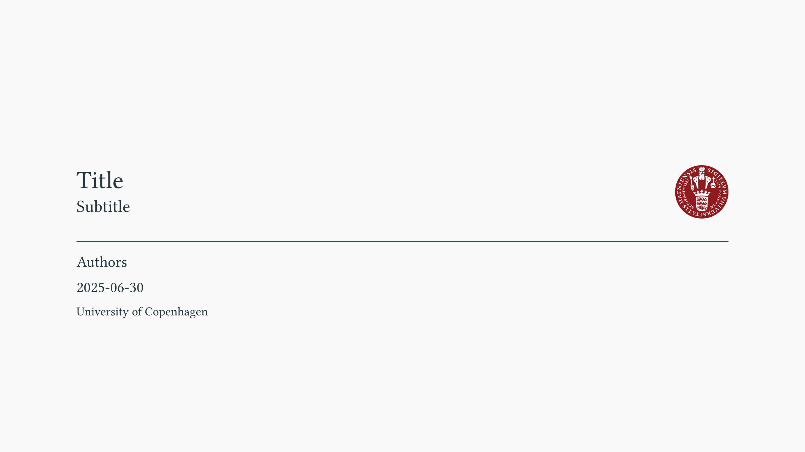

# ucph-nielsine-touying

> [!WARNING]
> This theme is **NOT** affiliated with the University of Copenhagen. The logo is the property of the University of Copenhagen.

**ucph-nielsine-touying** is a [Touying](https://github.com/touying-typ/touying) theme for creating presentation slides in [Typst](https://github.com/typst/typst), adhering to the core principles of the [style guide of the University of Copenhagen, Denmark](https://designguide.ku.dk/) (Danish). It is an **unofficial** theme and it is **NOT** affiliated with the University of Copenhagen.

This theme was partly created using components from [typslides](https://github.com/manjavacas/typslides) and [touying-unistra-pristine](https://github.com/spidersouris/touying-unistra-pristine).

# Sample slides

<kbd></kbd> <kbd></kbd>